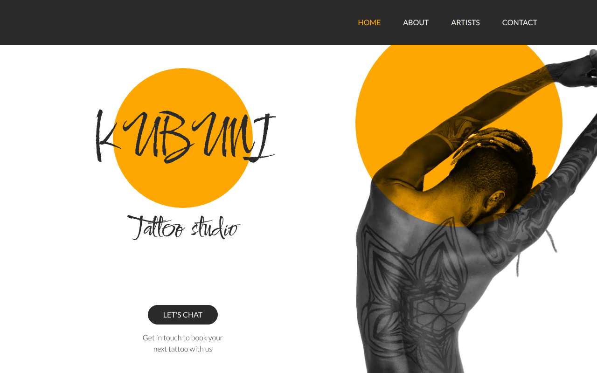

# Kubuni Tattoo Studio - Web Application

This is an implementation of a [web application designed by Mahya Golabi](https://www.behance.net/gallery/67651171/Inky-Tattoo-Studio-Web-design) developed using Next.js and Tailwind CSS.

## Table of contents

- [Overview](#overview)
- [My process](#my-process)
  - [Built with](#built-with)
- [Author](#author)

## Overview

<!-- ### Screenshot

### Links

- Live Site URL:  -->

## My process

### Built with

- Semantic HTML5 markup
- CSS custom properties
- Flexbox
- [Next.js](https://nextjs.org/) - React framework
- [Tailwind CSS](https://tailwindcss.com/) - For styles

## Author

- Website - [Web Developer Gillian Akpeki](https://wdga.xyz/)
- LinkedIn - [Gill A.](https://www.linkedin.com/in/cae-su-ra/)
